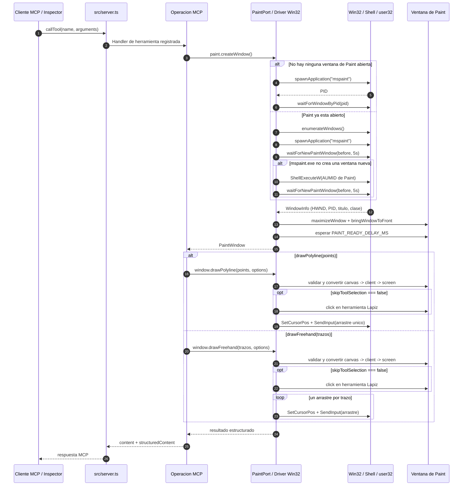

# Servidor MCP para dibujar en Microsoft Paint desde Node.js

[English](README.md) | [Español](README.es.md)

Este proyecto expone herramientas MCP (Model Context Protocol) para abrir Microsoft Paint y dibujar automáticamente desde Node.js y TypeScript.

Incluye estas herramientas:

- `paint_draw_freehand`
- `paint_draw_polyline`
- `paint_draw_logarithmic_spiral`

Estas herramientas automatizan Microsoft Paint mediante la API Win32 (`user32.dll`, `shell32.dll`) a través de [Koffi](https://koffi.dev/).

> Importante: la automatización de Paint funciona únicamente en Windows.
> Es una prueba de concepto educativa. La interacción con la ventana se hace con llamadas Win32 desde Node.js usando Koffi. No usa RobotJS, Playwright, Puppeteer, AutoHotkey ni captura/análisis visual de pantalla.

## Requisitos

- Windows 10 u 11 (64 bits)
- Node.js 18 o superior (probado con Node 24)
- Microsoft Paint instalado

## Instalación

```bash
npm install
```

Koffi instala un binario nativo. Si tu configuración de npm restringe scripts, aprueba Koffi explícitamente:

```bash
npm approve-scripts koffi
```

## Estructura del proyecto

Arquitectura hexagonal ligera: el dominio es puro y no conoce MCP ni Win32. Los adaptadores viven en `src/infrastructure/`. La composición ocurre en `src/server.ts`.

```text
src/
  server.ts                        # Punto de composición
  domain/
    drawing.ts                     # Tipos de dibujo, PaintPort, PaintWindow
    figures.ts                     # Helpers matemáticos puros para figuras
  infrastructure/
    win32/
      user32.ts                    # Bindings y constantes de user32.dll
      shell.ts                     # Binding mínimo de shell32.dll (ShellExecuteW)
      process.ts                   # Helpers genéricos de Windows
      paint.ts                     # Driver Win32 de Paint que implementa PaintPort
    mcp/
      schemas.ts                   # Esquemas zod compartidos
      errors.ts                    # Formateo de errores MCP
      registry.ts                  # Registro de todas las operaciones MCP
      operations/
        freehand.operation.ts
        polyline.operation.ts
        logarithmic-spiral.operation.ts
test/
  helpers.mjs                      # Helpers de cliente MCP + generadores de espiral
  logarithmic-spiral.test.mjs
  polyline.test.mjs
  freehand.test.mjs
```

Flujo de dependencias:

```text
src/server.ts -> infrastructure/mcp/*
                      |
                      v
               domain/drawing.ts <- infrastructure/win32/paint.ts
                      ^
                      |
               domain/figures.ts
```

## Ejecución

Desarrollo:

```bash
npm run dev
```

Compilar y ejecutar:

```bash
npm run build
npm start
```

## Diagrama de secuencia

Pipeline completo desde una llamada MCP hasta el dibujo real en Paint:



Lectura rápida:

- los clientes MCP nunca hablan con Win32 directamente
- cada operación crea su propia `PaintWindow`
- el driver Win32 decide cómo abrir o crear la nueva ventana de Paint
- la automatización real ocurre con APIs Win32 como `ShellExecuteW`, enumeración de ventanas, `SetCursorPos` y `SendInput`
- las herramientas devuelven respuestas MCP normales con `structuredContent`

## Agregar una operación

Cada operación MCP vive en su propio archivo `*.operation.ts` bajo `src/infrastructure/mcp/operations/`.

Flujo típico:

1. Agrega una figura pura a `src/domain/figures.ts` si hace falta.
2. Crea `src/infrastructure/mcp/operations/<nombre>.operation.ts`.
3. Define la entrada con esquemas zod.
4. En el handler, llama a `paint.createWindow()` y luego a `window.drawPolyline(...)` o `window.drawFreehand(...)`.
5. Registra la operación en `src/infrastructure/mcp/registry.ts`.

Ejemplo mínimo:

```ts
import type { McpServer } from "@modelcontextprotocol/sdk/server/mcp.js";
import type { PaintPort } from "../../domain/drawing.js";
import { logarithmicSpiral } from "../../domain/figures.js";
import { toolErrorResult } from "../errors.js";

export function registerLogarithmicSpiral(
  server: McpServer,
  paint: PaintPort,
): void {
  server.registerTool(
    "paint_draw_logarithmic_spiral",
    { title: "Espiral Logaritmica", description: "...", inputSchema: {} },
    async () => {
      try {
        const points = logarithmicSpiral(SPIRAL_PARAMS);
        const window = await paint.createWindow();
        const result = await window.drawPolyline(points, { stepDelayMs: 8 });
        return {
          content: [{ type: "text", text: "Listo." }],
          structuredContent: result,
        };
      } catch (error: unknown) {
        return toolErrorResult("paint_draw_logarithmic_spiral", error);
      }
    },
  );
}
```

## MCP Inspector

```bash
npm run inspect
```

Empieza con `paint_draw_logarithmic_spiral`, luego prueba `paint_draw_freehand` y `paint_draw_polyline`.

## Pruebas

Las pruebas de integración usan el runner nativo de Node y dibujan sobre ventanas reales de Paint, por lo que mueven el mouse real y dependen de la sesión interactiva de Windows.

Aunque cada operación crea su propia ventana, los tests deben correr en serie porque comparten el mouse real, el proceso de Paint y el foco de Windows. Por eso `npm test` usa `--test-concurrency=1`.

```bash
npm run build
npm test
```

Ejecutar un solo test:

```bash
node --test --test-concurrency=1 test/polyline.test.mjs
```

## Comportamiento de las herramientas

### `paint_draw_logarithmic_spiral`

Operación de ejemplo sin argumentos. Dibuja una espiral logarítmica `r = 1.1^theta` durante 6 vueltas. Es la forma más rápida de verificar el servidor desde MCP Inspector.

### `paint_draw_freehand`

Dibujo libre: uno o más trazos, cada uno dibujado con un único arrastre del mouse.

Parámetros:

- `strokes`: 1-100 trazos, cada uno como `{ points: [{x, y}, ...] }`, 2-1000 puntos por trazo
- `stepDelayMs`: entero, 0-200, por defecto `10`
- `skipToolSelection`: booleano opcional; `false` selecciona la herramienta Lápiz antes de dibujar

Payload por defecto del Inspector:

```json
{
  "strokes": [
    { "points": [{"x": 100, "y": 100}, {"x": 200, "y": 300}, {"x": 300, "y": 100}, {"x": 400, "y": 300}, {"x": 500, "y": 100}] },
    { "points": [{"x": 550, "y": 300}, {"x": 650, "y": 100}] }
  ],
  "stepDelayMs": 10
}
```

### `paint_draw_polyline`

Dibuja una polilínea conectada con un único arrastre. Es útil para curvas, espirales y figuras generadas.

Parámetros:

- `points`: 2-1000 puntos `{x, y}`
- `stepDelayMs`: entero, 0-200, por defecto `10`
- `skipToolSelection`: booleano opcional; `false` selecciona la herramienta Lápiz antes de dibujar

Payload por defecto del Inspector:

```json
{
  "points": [{"x": 200, "y": 100}, {"x": 600, "y": 100}, {"x": 600, "y": 500}, {"x": 200, "y": 500}],
  "stepDelayMs": 10
}
```

## Ciclo de vida de la ventana de Paint

Cada llamada crea su propia ventana de Paint y devuelve metadatos incluyendo:

- `windowHandle`
- `windowTitle`
- `processId`
- `createdBy`

`createdBy` puede ser:

- `opened`: Paint no estaba abierto, así que se abrió una ventana nueva
- `launched`: Paint ya estaba abierto y `mspaint.exe` creó una nueva ventana
- `shell`: `mspaint.exe` no creó una nueva ventana, así que se usó `ShellExecuteW` con el AUMID de Paint

Pipeline interno de dibujo:

1. `paint.createWindow()`
2. maximizar la ventana
3. traerla al primer plano
4. esperar `PAINT_READY_DELAY_MS` para que el lienzo esté listo
5. convertir coordenadas de canvas a cliente usando `CANVAS_ORIGIN`
6. validar límites
7. convertir a coordenadas de pantalla
8. dibujar con `SetCursorPos` y `SendInput`

## APIs Win32 usadas

- `EnumWindows`
- `GetWindowTextW`
- `GetClassNameW`
- `GetWindowThreadProcessId`
- `GetForegroundWindow`
- `IsWindow`
- `IsWindowVisible`
- `IsIconic`
- `SetForegroundWindow`
- `ShowWindow`
- `AttachThreadInput`
- `GetClientRect`
- `ClientToScreen`
- `SetCursorPos`
- `GetSystemMetrics`
- `SetProcessDpiAwarenessContext`
- `SendInput`
- `ShellExecuteW`

## Seguridad y validaciones

- valida que el `HWND` siga existiendo antes de usarlo
- rechaza coordenadas negativas
- rechaza puntos fuera del área cliente de Paint
- limita `stepDelayMs` a `0-200`
- limita puntos y trazos a rangos controlados
- devuelve una advertencia si Windows no permite llevar la ventana al primer plano

## Limitaciones

- solo Windows
- mueve el mouse real durante el dibujo
- depende de las restricciones de foco de Windows y de una sesión interactiva de escritorio
- usa offsets de layout hardcodeados medidos sobre una build específica de Paint moderno
- la selección opcional del Lápiz está basada en coordenadas y es menos fiable que dibujar con la herramienta ya activa
- `mspaint.exe` puede comportarse como stub UWP en Windows 11, así que el driver puede necesitar el fallback con `ShellExecuteW`
- las ventanas de Paint se acumulan y hay que cerrarlas manualmente

## Notas sobre Koffi

- `HWND` y `HANDLE` se tratan como punteros de 64 bits y se representan como `BigInt`
- `INPUT` / `MOUSEINPUT` deben coincidir con el layout exacto de x64
- `EnumWindows` usa un callback transitorio de Koffi que solo es válido durante la llamada
