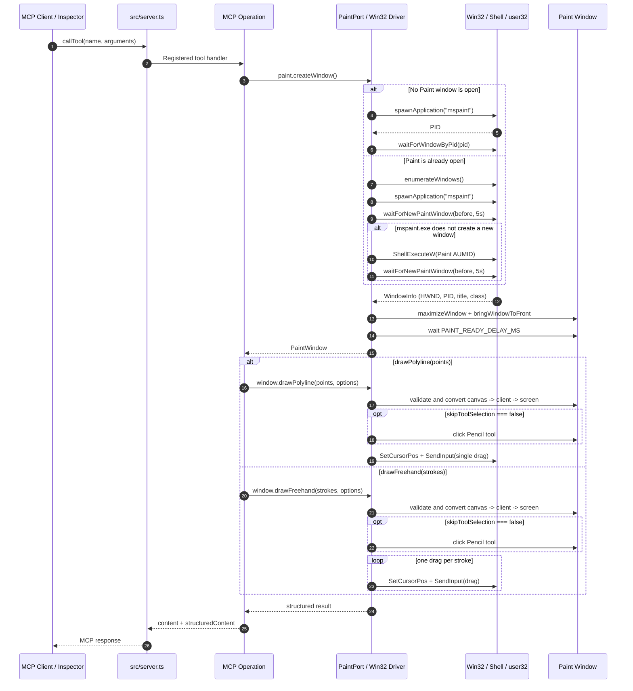

# MCP Server for Drawing in Microsoft Paint from Node.js

[English](README.md) | [Español](README.es.md)

This project exposes MCP (Model Context Protocol) tools that open Microsoft Paint and draw automatically from Node.js and TypeScript.

Included tools:

- `paint_draw_freehand`
- `paint_draw_polyline`
- `paint_draw_logarithmic_spiral`

These tools automate Microsoft Paint through the Win32 API (`user32.dll`, `shell32.dll`) via [Koffi](https://koffi.dev/).

> Important: Paint automation only works on Windows.
> This is an educational proof of concept. Window interaction is performed with Win32 calls from Node.js through Koffi. It does not use RobotJS, Playwright, Puppeteer, AutoHotkey, or screen capture / visual analysis.

## Requirements

- Windows 10 or 11 (64-bit)
- Node.js 18 or later (tested with Node 24)
- Microsoft Paint installed

## Installation

```bash
npm install
```

Koffi installs a native binary. If your npm setup restricts scripts, approve Koffi explicitly:

```bash
npm approve-scripts koffi
```

## Project Structure

Light hexagonal architecture: the domain is pure and does not know about MCP or Win32. The adapters live under `src/infrastructure/`. Composition happens in `src/server.ts`.

```text
src/
  server.ts                        # Composition root
  domain/
    drawing.ts                     # Drawing types, PaintPort, PaintWindow
    figures.ts                     # Pure math helpers for figures
  infrastructure/
    win32/
      user32.ts                    # user32.dll bindings and constants
      shell.ts                     # shell32.dll binding (ShellExecuteW)
      process.ts                   # Generic Windows helpers
      paint.ts                     # Win32 Paint driver implementing PaintPort
    mcp/
      schemas.ts                   # Shared zod schemas
      errors.ts                    # MCP tool error formatting
      registry.ts                  # Registers all MCP operations
      operations/
        freehand.operation.ts
        polyline.operation.ts
        logarithmic-spiral.operation.ts
test/
  helpers.mjs                      # MCP client helpers + spiral generators
  logarithmic-spiral.test.mjs
  polyline.test.mjs
  freehand.test.mjs
```

Dependency flow:

```text
src/server.ts -> infrastructure/mcp/*
                      |
                      v
               domain/drawing.ts <- infrastructure/win32/paint.ts
                      ^
                      |
               domain/figures.ts
```

## Running

Development:

```bash
npm run dev
```

Build and run:

```bash
npm run build
npm start
```

## Sequence Diagram

End-to-end pipeline from an MCP call to actual drawing in Paint:



Quick reading:

- MCP clients never talk to Win32 directly
- each operation creates its own `PaintWindow`
- the Win32 driver decides how to open or create the new Paint window
- actual automation happens through Win32 APIs such as `ShellExecuteW`, window enumeration, `SetCursorPos`, and `SendInput`
- tools return normal MCP responses with `structuredContent`

## Adding a New Operation

Each MCP operation lives in its own `*.operation.ts` file under `src/infrastructure/mcp/operations/`.

Typical flow:

1. Add a pure figure helper to `src/domain/figures.ts` if needed.
2. Create `src/infrastructure/mcp/operations/<name>.operation.ts`.
3. Define input with zod schemas.
4. In the handler, call `paint.createWindow()` and then `window.drawPolyline(...)` or `window.drawFreehand(...)`.
5. Register the operation in `src/infrastructure/mcp/registry.ts`.

Minimal example:

```ts
import type { McpServer } from "@modelcontextprotocol/sdk/server/mcp.js";
import type { PaintPort } from "../../domain/drawing.js";
import { logarithmicSpiral } from "../../domain/figures.js";
import { toolErrorResult } from "../errors.js";

export function registerLogarithmicSpiral(
  server: McpServer,
  paint: PaintPort,
): void {
  server.registerTool(
    "paint_draw_logarithmic_spiral",
    { title: "Logarithmic Spiral", description: "...", inputSchema: {} },
    async () => {
      try {
        const points = logarithmicSpiral(SPIRAL_PARAMS);
        const window = await paint.createWindow();
        const result = await window.drawPolyline(points, { stepDelayMs: 8 });
        return {
          content: [{ type: "text", text: "Done." }],
          structuredContent: result,
        };
      } catch (error: unknown) {
        return toolErrorResult("paint_draw_logarithmic_spiral", error);
      }
    },
  );
}
```

## MCP Inspector

```bash
npm run inspect
```

Start with `paint_draw_logarithmic_spiral`, then try `paint_draw_freehand` and `paint_draw_polyline`.

## Tests

Integration tests use Node's built-in test runner and draw on real Paint windows, so they move the real mouse and depend on the active Windows desktop session.

Even though each operation creates its own Paint window, tests must run sequentially because they share the real mouse, Paint process, and Windows focus. That is why `npm test` uses `--test-concurrency=1`.

```bash
npm run build
npm test
```

Run a single test:

```bash
node --test --test-concurrency=1 test/polyline.test.mjs
```

## Tool Behavior

### `paint_draw_logarithmic_spiral`

Zero-argument example operation. It draws a logarithmic spiral `r = 1.1^theta` for 6 turns. It is the fastest way to verify the server from MCP Inspector.

### `paint_draw_freehand`

Freehand drawing: one or more strokes, each stroke drawn with a single mouse drag.

Parameters:

- `strokes`: 1-100 strokes, each as `{ points: [{x, y}, ...] }`, 2-1000 points per stroke
- `stepDelayMs`: integer, 0-200, default `10`
- `skipToolSelection`: optional boolean; `false` selects the Pencil tool before drawing

Default Inspector payload:

```json
{
  "strokes": [
    { "points": [{"x": 100, "y": 100}, {"x": 200, "y": 300}, {"x": 300, "y": 100}, {"x": 400, "y": 300}, {"x": 500, "y": 100}] },
    { "points": [{"x": 550, "y": 300}, {"x": 650, "y": 100}] }
  ],
  "stepDelayMs": 10
}
```

### `paint_draw_polyline`

Draws a connected polyline with a single drag. Useful for curves, spirals, and generated figures.

Parameters:

- `points`: 2-1000 `{x, y}` points
- `stepDelayMs`: integer, 0-200, default `10`
- `skipToolSelection`: optional boolean; `false` selects the Pencil tool before drawing

Default Inspector payload:

```json
{
  "points": [{"x": 200, "y": 100}, {"x": 600, "y": 100}, {"x": 600, "y": 500}, {"x": 200, "y": 500}],
  "stepDelayMs": 10
}
```

## Paint Window Lifecycle

Each tool call creates its own Paint window and returns metadata including:

- `windowHandle`
- `windowTitle`
- `processId`
- `createdBy`

`createdBy` can be:

- `opened`: Paint was not open, so a fresh window was opened
- `launched`: Paint was already open and `mspaint.exe` created a new window
- `shell`: `mspaint.exe` did not create a new window, so `ShellExecuteW` was used with the Paint AUMID

Internal drawing pipeline:

1. `paint.createWindow()`
2. Maximize the window
3. Bring it to the foreground
4. Wait `PAINT_READY_DELAY_MS` so the canvas is actually ready
5. Convert canvas coordinates to client coordinates using `CANVAS_ORIGIN`
6. Validate bounds
7. Convert to screen coordinates
8. Draw with `SetCursorPos` and `SendInput`

## Win32 APIs Used

- `EnumWindows`
- `GetWindowTextW`
- `GetClassNameW`
- `GetWindowThreadProcessId`
- `GetForegroundWindow`
- `IsWindow`
- `IsWindowVisible`
- `IsIconic`
- `SetForegroundWindow`
- `ShowWindow`
- `AttachThreadInput`
- `GetClientRect`
- `ClientToScreen`
- `SetCursorPos`
- `GetSystemMetrics`
- `SetProcessDpiAwarenessContext`
- `SendInput`
- `ShellExecuteW`

## Safety and Validation

- validates that the `HWND` still exists before using it
- rejects negative coordinates
- rejects points outside the Paint client area
- limits `stepDelayMs` to `0-200`
- limits points and strokes to controlled ranges
- returns a warning if Windows does not allow the window to reach the foreground

## Limitations

- Windows only
- moves the real mouse during drawing
- depends on Windows foreground restrictions and an interactive desktop session
- uses hardcoded layout offsets measured on a specific modern Paint build
- optional Pencil selection is coordinate-based and less reliable than drawing with the already active tool
- `mspaint.exe` can behave like a UWP stub on Windows 11, so the driver may need the `ShellExecuteW` fallback
- Paint windows accumulate and must be closed manually

## Koffi Notes

- `HWND` and `HANDLE` are treated as 64-bit pointers and represented as `BigInt`
- `INPUT` / `MOUSEINPUT` must match the exact x64 layout
- `EnumWindows` uses a transient Koffi callback that is only valid during the call
