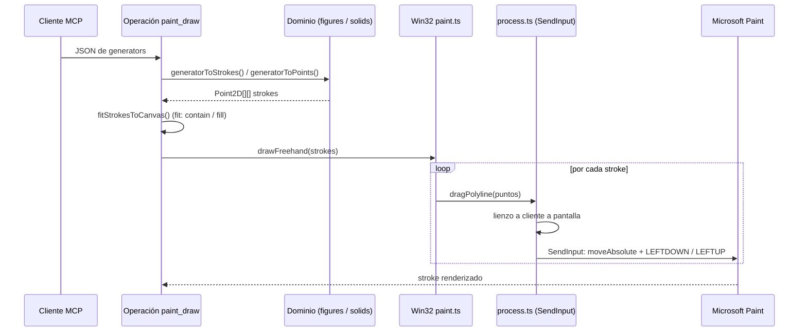
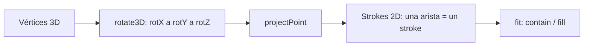

# El DSL de dibujo: `paint_draw` (2D) y `paint_draw_3d` (sólidos)

Este documento explica el lenguaje de dibujo de las tools MCP `paint_draw`
(2D) y `paint_draw_3d` (sólidos/mallas 3D): desde el JSON que reciben hasta
los movimientos de mouse que se ejecutan en Paint. La matemática es pura y
vive en dos módulos del dominio:

- `src/domain/figures.ts` — figuras 2D y composición.
- `src/domain/solids.ts` — sólidos 3D proyectados a alambre.

Las operaciones MCP traducen el DSL a **strokes** (polilíneas de puntos) y
delegan el dibujo al puerto `PaintPort` (adaptador Win32 → `SendInput`):

- `src/infrastructure/mcp/operations/paint-draw.operation.ts` — 2D.
- `src/infrastructure/mcp/operations/paint-draw-3d.operation.ts` — 3D.

> La tool `paint_draw` no acepta generadores 3D (solid/torus/torusKnot/…):
> usa `paint_draw_3d` para eso.

---

## 1. Anatomía de la llamada

```jsonc
{
  "mode": "generator",          // "freehand" | "generator"
  "tool": "brush",              // "brush" | "pencil"
  "fit": "contain",             // "none" | "contain" | "fill"
  "stepDelayMs": 10,            // 0–200 ms entre movimientos del mouse
  "thickness": 4,               // 1–50 px (opcional; grosor de brocha/lápiz)
  "verify": true,               // verificación por captura de pantalla
  "canvas": { "width": 1920, "height": 1080 },  // opcional: redimensiona el lienzo antes de dibujar
  "generators": [ /* 1–100 generadores */ ],
  // o bien, para modo "freehand":
  // "strokes": [ { "points": [{x,y}, ...] } ]  // 1–500 trazos
}
```

**Pipeline completo** (modo generator):



Regla central: **cada arista/polilínea es un stroke = un arrastre del mouse**.
Los límites por llamada son 500 trazos y 1000 puntos por trazo.

> El dibujo se inyecta íntegro por `SendInput` (movimiento absoluto de mouse
> + eventos de botón), **no** con `SetCursorPos` + `mouse_event`: mezclar
> ambos mecanismos hace que Paint moderno (WinUI3/XAML) no sincronice el
> mouse-down con la posición y no interprete el trazo.

## 2. Generadores 2D

Todos devuelven una polilínea (un solo stroke) salvo `disk`, `grid` y
`dotsAlongPath`, que devuelven varios. Las coordenadas son del lienzo lógico
(el espacio de diseño; `fit` las re-mapea si se pide).

| kind | Parámetros | Matemática |
|---|---|---|
| `ellipse` | `x, y, width, height, stepCount=72` | Elipse paramétrica: `cx=x+w/2`, `rx=w/2`; 73 puntos (cierra). |
| `circle` | `cx, cy, radius, stepCount=72` | `ellipse` con `x=cx-r, w=2r`. |
| `arc` | `cx, cy, radius, startDeg, endDeg, stepDeg=4` | Arco en grados; `steps = ceil(|end-start|/stepDeg)`, interpolación angular. |
| `rectangle` | `x, y, width, height` | 5 puntos (esquinas + cierre). |
| `roundedRectangle` | `x, y, width, height, radius=24, stepDeg=12` | 4 lados + 4 cuartos de arco de radio `min(radius, min(w,h)/2)`. |
| `regularPolygon` | `cx, cy, radius, sides (3–64), rotationDeg=-90` | Vértices en el círculo; `rotationDeg` orienta (por defecto un vértice arriba). |
| `starPolygon` | `cx, cy, outerRadius, innerRadius, points (3–32), rotationDeg=-90` | 2·points vértices alternando radio exterior/interior. |
| `polyline` | `points` (2–1000) | Se dibuja tal cual: la polilínea libre del DSL. |
| `logarithmicSpiral` | `cx, cy, growth=1.1, turns=6, angleStep=0.05, scale=7` | `r = scale·growth^θ` desde el centro hacia afuera. |

### Repetidores

| kind | Parámetros | Comportamiento |
|---|---|---|
| `grid` | `x, y, width, height, cols (≤50), rows (≤50), shape (circle/disk/rectangle/ellipse), radius/itemWidth/itemHeight, stepCount` | Mosaico: repite la figura en una retícula `cols×rows` centrada en celdas de `width/cols × height/rows`. Un stroke por ítem (los discos se expanden en filas de relleno). Validación: `cols·rows ≤ 400`. |
| `dotsAlongPath` | `path (2–1000 pts), radius=3, spacing=16, stepCount` | Círculos espaciados `spacing` px a lo largo de un sendero (interpolación por segmentos; el primero cae a `spacing` del inicio). Validación: `floor(length/spacing) ≤ 500` círculos. |

## 3. Sólidos 3D proyectados a alambre (`paint_draw_3d`)

Esta sección describe la tool **`paint_draw_3d`** (operation
`paint-draw-3d.operation.ts`), que comparte el pipeline de `paint_draw`
(`fit`, `canvas`, verificación por captura) pero con generadores propios:
`solid`, `torus`, `torusKnot`, `revolution` y `wireframe`. El esquema acepta
`generators` (1–100) con esos kinds y los mismos parámetros comunes (`tool`,
`fit`, `canvas`, `stepDelayMs`).

Se definen **centrados en el origen** (coordenadas negativas incluidas), se
rotan en el orden **X → Y → Z** y se proyectan a 2D. Por eso se recomienda
`fit: "contain"`: escala y centra el modelo en el lienzo sin calcular a mano.



Proyección: `ortho` (f = 1) o `perspective` (f = d / max(d − z, 0.1)).

| Parámetro | Significado |
|---|---|
| `rotX / rotY / rotZ` | Grados, orden X→Y→Z (por defecto −20 / 25 / 0). |
| `projection` | `ortho` (sin perspectiva) o `perspective` (cámara a `perspectiveDistance` del origen; lo cercano se agranda). |
| `perspectiveDistance` | Distancia de cámara en unidades del modelo (por defecto 3). |
| `size` | Escala final en px (por defecto 120). |

### 3.1 `solid` — poliedros regulares y compuestos

El `kind: "solid"` usa `solidMesh()` + `projectMesh()`: **una arista = un
stroke de 2 puntos**.

| solid | Construcción | Vértices / aristas |
|---|---|---|
| `tetrahedron` | 4 vértices alternados (±1,±1,±1), `allPairs(4)` | 4 / 6 |
| `cube` | 8 vértices (±1)³; aristas entre parejas que difieren en 1 coordenada | 8 / 12 |
| `octahedron` | 6 vértices en los ejes; `edgesAtDistance(√2)` | 6 / 12 |
| `icosahedron` | 12 vértices con la proporción áurea PHI; aristas a distancia 2 | 12 / 30 |
| `dodecahedron` | 8 vértices (±1)³ + 12 de los rectángulos áureos; distancia `2/PHI` | 20 / 30 |
| `greatIcosahedron` | Comparte el esqueleto del icosaedro (30 aristas exactas) | 12 / 30 |
| `starOctangula` | Dos tetraedros cruzados (compuesto regular) | 8 / 12 |
| `tesseract` | Hipercubo (±1)⁴ → proyección con perspectiva en w (cámara 2.5) → 3D | 16 / 32 |

`edgesAtDistance()` es la joya del módulo: genera la malla buscando pares de
vértices que distan exactamente la arista del sólido — los poliedros
platónicos se definen solo por sus vértices.

Opcional para `greatIcosahedron`: `starFaces: true` añade las **20 caras
pentagrama** que se cruzan (`greatIcosahedronFaces()`: cada cara triangular
del icosaedro se expande con los terceros vértices de las caras vecinas en el
ciclo a→x→b→y→c). Es una aproximación visual; el esqueleto de 30 aristas es
el sólido exacto.

### 3.2 `torus`

`torusPolygons()`: paramétrico con anillos de latitud y meridianos.
`rings × segments` — cada anillo y cada meridiano es un stroke cerrado.

| Parámetro | Significado |
|---|---|
| `majorRadius` | Radio del agujero al centro del tubo. |
| `tubeRadius` | Radio del tubo. |
| `segments` (6–48) | Puntos por anillo (meridianos). |
| `rings` (3–24) | Anillos de latitud. |

### 3.3 `torusKnot`

`torusKnotPoints()`: curva paramétrica enlazada **sobre** la superficie de un
toro (`p` vueltas alrededor del agujero, `q` alrededor del tubo):

```
r(t) = radius + tubeRadius·cos(q·t)
x = r·cos(p·t)  y = r·sin(p·t)  z = tubeRadius·sin(q·t)
```

Devuelve **una única polilínea** (1 stroke, `steps` 50–1000). `(p, q)` deben
ser coprimos para que el nudo no se repita (p. ej. 2,3 → trébol).

### 3.4 `revolution` — superficies de revolución

`revolutionPolygons()`: el **perfil** es una polilínea 2D en el plano donde
`x = distancia al eje` y `y = altura` (el "jarrón"). Se rota alrededor del
**eje Y** en `segments` (4–64) posiciones:

```
ring(seg) = { x = profile.x·cos(u), y = profile.y, z = profile.x·sin(u) }
```

Devuelve un anillo por cada punto del perfil + un meridiano por segmento
(anillos y meridianos son strokes cerrados). Con un perfil `[{x:60,y:-80},
{x:30,y:0}, {x:80,y:120}]` obtienes un jarrón.

### 3.5 `wireframe` — malla genérica

`wireframeStrokes()`: pasas los vértices 3D y las aristas explícitas
(`{vertices: [{x,y,z}…], edges: [[i,j]…]}`), y se aplica la misma rotación +
proyección. Es el escape hatch: cualquier malla customizada (un edificio, una
molécula, un poliedro raro) sin añadir código al DSL. Límites: 256 vértices,
500 aristas.

## 4. `fit`: contener o rellenar el lienzo

`fitStrokes()` (`figures.ts`) re-mapea los strokes al lienzo lógico:

1. Calcula el **bounding box conjunto** de todos los strokes.
2. Escala: `contain` = `min(anchoDisp/w, altoDisp/h)` (preserva proporción);
   `fill` = escala independiente por eje (estira).
3. Centra en el lienzo.
4. `margin` (5% por defecto) reserva aire alrededor del dibujo.

Gracias a esto puedes definir un sólido en un espacio de diseño propio
(centrado en el origen, tamaño arbitrario) y dejarlo perfectamente encuadrado.

## 5. Modo `freehand`

`mode: "freehand"` no usa generadores: los `strokes` se pasan tal cual (con
`fit` opcional). Es el modo para dibujos libres o para reutilizar geometría
generada fuera del DSL.

## 6. Ejemplos

Ejemplos 2D de la tool `paint_draw`:

```jsonc
// Estrella de 5 puntas centrada, 200 px de radio exterior
{ "mode": "generator", "generators": [
    { "kind": "starPolygon", "cx": 400, "cy": 300, "outerRadius": 200, "innerRadius": 80, "points": 5 }
] }

// Espiral logarítmica de 4 vueltas
{ "mode": "generator", "generators": [
    { "kind": "logarithmicSpiral", "cx": 500, "cy": 400, "growth": 1.15, "turns": 4, "scale": 4 }
] }

// Mosaico 10×8 de círculos (laberinto) en un lienzo 1920×1080
{ "mode": "generator", "fit": "none", "generators": [
    { "kind": "grid", "x": 60, "y": 60, "width": 1800, "height": 960, "cols": 10, "rows": 8,
      "shape": "circle", "radius": 6 }
] }

// Varios generadores en una llamada (composición)
{ "mode": "generator", "fit": "contain", "generators": [
    { "kind": "circle", "cx": 0, "cy": 0, "radius": 120 },
    { "kind": "starPolygon", "cx": 0, "cy": 0, "outerRadius": 90, "innerRadius": 40, "points": 6 }
] }
```

Ejemplos 3D de la tool `paint_draw_3d`:

```jsonc
// Tesseract en perspectiva, encuadrado automáticamente
{ "mode": "generator", "fit": "contain", "generators": [
    { "kind": "solid", "solid": "tesseract", "size": 150,
      "rotX": -25, "rotY": 30, "projection": "perspective" }
] }

// Nudo toroidal (2,3): el clásico nudo de trébol
{ "mode": "generator", "fit": "contain", "generators": [
    { "kind": "torusKnot", "p": 2, "q": 3, "radius": 90, "tubeRadius": 30, "steps": 400 }
] }

// Jarrón por revolución de un perfil
{ "mode": "generator", "fit": "contain", "generators": [
    { "kind": "revolution", "segments": 24, "profile": [
        { "x": 20, "y": -120 }, { "x": 90, "y": -80 }, { "x": 60, "y": -40 },
        { "x": 70, "y": 0 },   { "x": 90, "y": 60 },   { "x": 20, "y": 100 }
    ] }
] }

// Gran icosaedro con las caras pentagrama visibles
{ "mode": "generator", "fit": "contain", "generators": [
    { "kind": "solid", "solid": "greatIcosahedron", "starFaces": true, "size": 140 }
] }

// Varios generadores 3D en una llamada (composición)
{ "mode": "generator", "fit": "contain", "generators": [
    { "kind": "torus", "majorRadius": 100, "tubeRadius": 35 },
    { "kind": "solid", "solid": "cube", "size": 60 }
] }
```

## 7. Dónde está cada pieza

| Pieza | Archivo |
|---|---|
| Esquemas zod + traducción DSL→strokes (2D) | `src/infrastructure/mcp/operations/paint-draw.operation.ts` |
| Esquemas zod + traducción (3D) | `src/infrastructure/mcp/operations/paint-draw-3d.operation.ts` |
| Lógica compartida (fit al canvas, provenance, verificación) | `src/infrastructure/mcp/operations/draw-shared.ts` |
| Figuras 2D puras, grid, dots, fit, boundingBox | `src/domain/figures.ts` |
| Sólidos, rotaciones, proyección, toro, nudo, revolución, wireframe | `src/domain/solids.ts` |
| Tipos del dominio (Stroke, Point2D, PaintPort…) | `src/domain/drawing.ts` |
| Ejecución Win32 (drag, teclas, coordenadas, KeyTips) | `src/infrastructure/win32/paint.ts` + `process.ts` |
