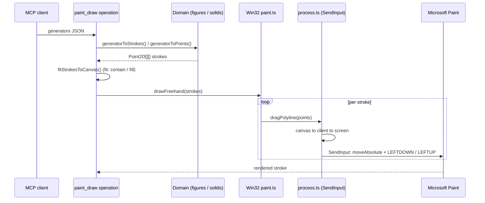
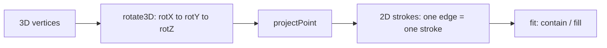

# The drawing DSL: `paint_draw` (2D) and `paint_draw_3d` (solids)

This document explains the drawing language of the MCP tools `paint_draw`
(2D) and `paint_draw_3d` (3D solids/meshes): from the JSON they receive to
the mouse movements executed in Paint. The math is pure and lives in two
domain modules:

- `src/domain/figures.ts` — 2D figures and composition.
- `src/domain/solids.ts` — 3D solids projected to wireframe.

The MCP operations translate the DSL into **strokes** (polylines of points)
and delegate drawing to the `PaintPort` (Win32 adapter → `SendInput`):

- `src/infrastructure/mcp/operations/paint-draw.operation.ts` — 2D.
- `src/infrastructure/mcp/operations/paint-draw-3d.operation.ts` — 3D.

> The `paint_draw` tool does not accept 3D generators (solid/torus/torusKnot/…):
> use `paint_draw_3d` for those.

---

## 1. Anatomy of a call

```jsonc
{
  "mode": "generator",          // "freehand" | "generator"
  "tool": "brush",              // "brush" | "pencil"
  "fit": "contain",             // "none" | "contain" | "fill"
  "stepDelayMs": 10,            // 0–200 ms between mouse movements
  "thickness": 4,               // 1–50 px (optional; brush/pencil width)
  "verify": true,               // screenshot-based verification
  "canvas": { "width": 1920, "height": 1080 },  // optional: resize canvas before drawing
  "generators": [ /* 1–100 generators */ ],
  // or, for "freehand" mode:
  // "strokes": [ { "points": [{x,y}, ...] } ]  // 1–500 strokes
}
```

**Full pipeline** (generator mode):



Central rule: **each edge/polyline is a stroke = one mouse drag**.
Per-call limits are 500 strokes and 1000 points per stroke.

> The whole gesture is injected through `SendInput` (absolute mouse movement
> + button events), **not** with `SetCursorPos` + `mouse_event`: mixing both
> mechanisms makes modern Paint (WinUI3/XAML) fail to sync the mouse-down
> with the position and it does not interpret the stroke.

## 2. 2D generators

All return a single polyline (one stroke) except `disk`, `grid` and
`dotsAlongPath`, which return several. Coordinates belong to the logical
canvas (the design space; `fit` remaps them if requested).

| kind | Parameters | Math |
|---|---|---|
| `ellipse` | `x, y, width, height, stepCount=72` | Parametric ellipse: `cx=x+w/2`, `rx=w/2`; 73 points (closes). |
| `circle` | `cx, cy, radius, stepCount=72` | `ellipse` with `x=cx-r, w=2r`. |
| `arc` | `cx, cy, radius, startDeg, endDeg, stepDeg=4` | Arc in degrees; `steps = ceil(|end-start|/stepDeg)`, angular interpolation. |
| `rectangle` | `x, y, width, height` | 5 points (corners + closure). |
| `roundedRectangle` | `x, y, width, height, radius=24, stepDeg=12` | 4 sides + 4 quarter arcs of radius `min(radius, min(w,h)/2)`. |
| `regularPolygon` | `cx, cy, radius, sides (3–64), rotationDeg=-90` | Vertices on the circle; `rotationDeg` orients (by default one vertex on top). |
| `starPolygon` | `cx, cy, outerRadius, innerRadius, points (3–32), rotationDeg=-90` | 2·points vertices alternating outer/inner radius. |
| `polyline` | `points` (2–1000) | Drawn as-is: the DSL's free polyline. |
| `logarithmicSpiral` | `cx, cy, growth=1.1, turns=6, angleStep=0.05, scale=7` | `r = scale·growth^θ` from the center outward. |

### Repeaters

| kind | Parameters | Behavior |
|---|---|---|
| `grid` | `x, y, width, height, cols (≤50), rows (≤50), shape (circle/disk/rectangle/ellipse), radius/itemWidth/itemHeight, stepCount` | Mosaic: repeats the figure on a `cols×rows` grid centered in cells of `width/cols × height/rows`. One stroke per item (disks expand into fill rows). Validation: `cols·rows ≤ 400`. |
| `dotsAlongPath` | `path (2–1000 pts), radius=3, spacing=16, stepCount` | Circles spaced `spacing` px along a path (segment interpolation; the first lands `spacing` from the start). Validation: `floor(length/spacing) ≤ 500` circles. |

## 3. 3D solids projected to wireframe (`paint_draw_3d`)

This section describes the **`paint_draw_3d`** tool (operation
`paint-draw-3d.operation.ts`), which shares `paint_draw`'s pipeline (`fit`,
`canvas`, screenshot verification) but with its own generators: `solid`,
`torus`, `torusKnot`, `revolution` and `wireframe`. The schema accepts
`generators` (1–100) with those kinds and the same common parameters (`tool`,
`fit`, `canvas`, `stepDelayMs`).

Models are defined **centered at the origin** (negative coordinates
included), rotated in **X → Y → Z** order and projected to 2D. That is why
`fit: "contain"` is recommended: it scales and centers the model on the
canvas with no manual math.



Projection: `ortho` (f = 1) or `perspective` (f = d / max(d − z, 0.1)).

| Parameter | Meaning |
|---|---|
| `rotX / rotY / rotZ` | Degrees, X→Y→Z order (default −20 / 25 / 0). |
| `projection` | `ortho` (no perspective) or `perspective` (camera at `perspectiveDistance` from the origin; close objects enlarge). |
| `perspectiveDistance` | Camera distance in model units (default 3). |
| `size` | Final scale in px (default 120). |

### 3.1 `solid` — regular and compound polyhedra

The `kind: "solid"` uses `solidMesh()` + `projectMesh()`: **one edge = one
2-point stroke**.

| solid | Construction | Vertices / edges |
|---|---|---|
| `tetrahedron` | 4 alternating vertices (±1,±1,±1), `allPairs(4)` | 4 / 6 |
| `cube` | 8 vertices (±1)³; edges between pairs differing in 1 coordinate | 8 / 12 |
| `octahedron` | 6 axis vertices; `edgesAtDistance(√2)` | 6 / 12 |
| `icosahedron` | 12 vertices with golden ratio PHI; edges at distance 2 | 12 / 30 |
| `dodecahedron` | 8 vertices (±1)³ + 12 from the golden rectangles; distance `2/PHI` | 20 / 30 |
| `greatIcosahedron` | Shares the icosahedron's skeleton (30 exact edges) | 12 / 30 |
| `starOctangula` | Two crossed tetrahedra (regular compound) | 8 / 12 |
| `tesseract` | Hypercube (±1)⁴ → perspective projection in w (camera 2.5) → 3D | 16 / 32 |

`edgesAtDistance()` is the module's gem: it builds the mesh by looking for
vertex pairs exactly one edge apart — the Platonic solids are defined by
their vertices alone.

Optional for `greatIcosahedron`: `starFaces: true` adds the **20 crossing
pentagram faces** (`greatIcosahedronFaces()`: each triangular face of the
icosahedron is expanded with the third vertices of neighboring faces in the
a→x→b→y→c cycle). It is a visual approximation; the 30-edge skeleton is the
exact solid.

### 3.2 `torus`

`torusPolygons()`: parametric with latitude rings and meridians.
`rings × segments` — each ring and each meridian is a closed stroke.

| Parameter | Meaning |
|---|---|
| `majorRadius` | Radius from the hole to the tube center. |
| `tubeRadius` | Tube radius. |
| `segments` (6–48) | Points per ring (meridians). |
| `rings` (3–24) | Latitude rings. |

### 3.3 `torusKnot`

`torusKnotPoints()`: a linked parametric curve **on** a torus surface
(`p` turns around the hole, `q` around the tube):

```
r(t) = radius + tubeRadius·cos(q·t)
x = r·cos(p·t)  y = r·sin(p·t)  z = tubeRadius·sin(q·t)
```

Returns **a single polyline** (1 stroke, `steps` 50–1000). `(p, q)` must be
coprime so the knot does not repeat (e.g. 2,3 → trefoil).

### 3.4 `revolution` — surfaces of revolution

`revolutionPolygons()`: the **profile** is a 2D polyline in the plane where
`x = distance to the axis` and `y = height` (the "vase"). It is rotated
around the **Y axis** in `segments` (4–64) positions:

```
ring(seg) = { x = profile.x·cos(u), y = profile.y, z = profile.x·sin(u) }
```

Returns one ring per profile point + one meridian per segment (rings and
meridians are closed strokes). With a profile like `[{x:60,y:-80},
{x:30,y:0}, {x:80,y:120}]` you get a vase.

### 3.5 `wireframe` — generic mesh

`wireframeStrokes()`: you pass the 3D vertices and the explicit edges
(`{vertices: [{x,y,z}…], edges: [[i,j]…]}`), and the same rotation +
projection is applied. It is the escape hatch: any custom mesh (a building,
a molecule, a rare polyhedron) without adding code to the DSL. Limits: 256
vertices, 500 edges.

## 4. `fit`: contain or fill the canvas

`fitStrokes()` (`figures.ts`) remaps the strokes onto the logical canvas:

1. Computes the **joint bounding box** of all strokes.
2. Scales: `contain` = `min(dispW/w, dispH/h)` (preserves aspect ratio);
   `fill` = independent per-axis scale (stretches).
3. Centers on the canvas.
4. `margin` (5% by default) reserves breathing room around the drawing.

Thanks to this you can define a solid in its own design space (centered at
the origin, arbitrary size) and have it perfectly framed.

## 5. `freehand` mode

`mode: "freehand"` does not use generators: `strokes` are passed as-is (with
optional `fit`). It is the mode for free drawings or for reusing geometry
generated outside the DSL.

## 6. Examples

2D examples for the `paint_draw` tool:

```jsonc
// Centered 5-point star, 200 px outer radius
{ "mode": "generator", "generators": [
    { "kind": "starPolygon", "cx": 400, "cy": 300, "outerRadius": 200, "innerRadius": 80, "points": 5 }
] }

// 4-turn logarithmic spiral
{ "mode": "generator", "generators": [
    { "kind": "logarithmicSpiral", "cx": 500, "cy": 400, "growth": 1.15, "turns": 4, "scale": 4 }
] }

// 10×8 circle mosaic (labyrinth) on a 1920×1080 canvas
{ "mode": "generator", "fit": "none", "generators": [
    { "kind": "grid", "x": 60, "y": 60, "width": 1800, "height": 960, "cols": 10, "rows": 8,
      "shape": "circle", "radius": 6 }
] }

// Several generators in one call (composition)
{ "mode": "generator", "fit": "contain", "generators": [
    { "kind": "circle", "cx": 0, "cy": 0, "radius": 120 },
    { "kind": "starPolygon", "cx": 0, "cy": 0, "outerRadius": 90, "innerRadius": 40, "points": 6 }
] }
```

3D examples for the `paint_draw_3d` tool:

```jsonc
// Tesseract in perspective, automatically framed
{ "mode": "generator", "fit": "contain", "generators": [
    { "kind": "solid", "solid": "tesseract", "size": 150,
      "rotX": -25, "rotY": 30, "projection": "perspective" }
] }

// (2,3) torus knot: the classic trefoil
{ "mode": "generator", "fit": "contain", "generators": [
    { "kind": "torusKnot", "p": 2, "q": 3, "radius": 90, "tubeRadius": 30, "steps": 400 }
] }

// Vase by revolving a profile
{ "mode": "generator", "fit": "contain", "generators": [
    { "kind": "revolution", "segments": 24, "profile": [
        { "x": 20, "y": -120 }, { "x": 90, "y": -80 }, { "x": 60, "y": -40 },
        { "x": 70, "y": 0 },   { "x": 90, "y": 60 },   { "x": 20, "y": 100 }
    ] }
] }

// Great icosahedron with visible pentagram faces
{ "mode": "generator", "fit": "contain", "generators": [
    { "kind": "solid", "solid": "greatIcosahedron", "starFaces": true, "size": 140 }
] }

// Several 3D generators in one call (composition)
{ "mode": "generator", "fit": "contain", "generators": [
    { "kind": "torus", "majorRadius": 100, "tubeRadius": 35 },
    { "kind": "solid", "solid": "cube", "size": 60 }
] }
```

## 7. Where each piece lives

| Piece | File |
|---|---|
| zod schemas + DSL→strokes translation (2D) | `src/infrastructure/mcp/operations/paint-draw.operation.ts` |
| zod schemas + translation (3D) | `src/infrastructure/mcp/operations/paint-draw-3d.operation.ts` |
| Shared logic (canvas fit, provenance, verification) | `src/infrastructure/mcp/operations/draw-shared.ts` |
| Pure 2D figures, grid, dots, fit, boundingBox | `src/domain/figures.ts` |
| Solids, rotations, projection, torus, knot, revolution, wireframe | `src/domain/solids.ts` |
| Domain types (Stroke, Point2D, PaintPort…) | `src/domain/drawing.ts` |
| Win32 execution (drag, keys, coordinates, KeyTips) | `src/infrastructure/win32/paint.ts` + `process.ts` |
