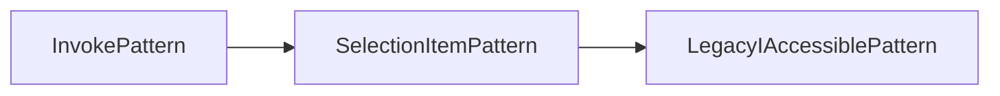
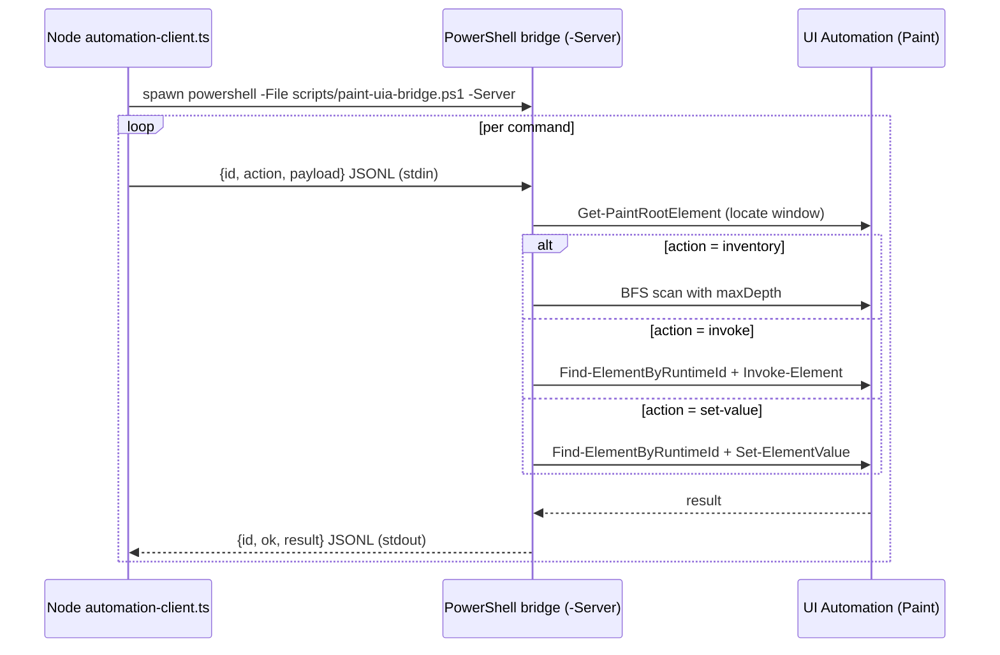

# Windows Automation (UIA) with PowerShell: guide and discoveries

This document explains how UI Automation works, what dependencies it needs,
how this repository's PowerShell bridge is built
(`scripts/paint-uia-bridge.ps1`) and records **everything discovered
empirically** during development (test environment: Paint 11.2605.71.0,
Windows 11, Spanish language).

---

## Table of contents

1. [What UI Automation is](#1-what-ui-automation-is)
2. [Dependencies](#2-dependencies)
3. [The accessibility tree](#3-the-accessibility-tree)
4. [Patterns](#4-patterns)
5. [runtimeId and element lookup](#5-runtimeid-and-element-lookup)
6. [How the repository's bridge works](#6-how-the-repositorys-bridge-works)
7. [The server side (Node.js)](#7-the-server-side-nodejs)
8. [Discovery log](#8-discovery-log)
9. [References](#9-references)

---

## 1. What UI Automation is

UI Automation (UIA) is Windows' accessibility framework (since Vista).
Every control exposes an **automation element** (a "peer") describing its
role, its name and the **patterns** of behavior it supports. The same tree
used by Narrator (the screen reader) is the one we use to automate: if a
control is accessible to a blind user, it is automatable with code.

Key points:

- It is a **COM** API with a .NET wrapper: in PowerShell we use the types of
  the `UIAutomationClient` assembly (namespace `Windows.Automation`).
- It is **independent of the control's framework**: classic Win32, WinForms,
  WPF, XAML/UWP (WinUI) and web (Chrome/Edge) expose UIA peers.
- There are two consumption models: **client** (us: we read the tree and
  operate patterns) and **provider** (the control: it implements peers).

## 2. Dependencies

| Dependency | What it provides | Does it need installing? |
|---|---|---|
| PowerShell 5.1 | The script host | Ships with Windows |
| .NET Framework 4.8 | The CLR where UIA assemblies run | Ships with Windows 11 |
| `UIAutomationClient.dll` | Client types: `AutomationElement`, patterns | In the GAC; load with `Add-Type -AssemblyName UIAutomationClient` |
| `UIAutomationTypes.dll` | Enums and support types (`TreeScope`, `Condition`…) | Same |
| `user32.dll` | `EnumWindows`, `SendInput`, `SetCursorPos`, `ClientToScreen`… | System |

Minimal loading:

```powershell
Add-Type -AssemblyName UIAutomationClient
Add-Type -AssemblyName UIAutomationTypes
```

> Note: the NuGet package `UIAutomationClient` only exists for .NET Core
> 3.0+/5+; in PowerShell 5.1 the assemblies are already in the .NET
> Framework GAC and there is nothing to download.

## 3. The accessibility tree

The desktop is the root (`AutomationElement.RootElement`). Each window is a
child; inside it, panels, buttons, fields, etc. It is traversed with
`FindAll` / `FindFirst` specifying a `TreeScope`:

| TreeScope | Scope |
|---|---|
| `Element` | Only the element itself |
| `Children` | Direct children |
| `Descendants` | The whole subtree (the most used) |
| `Subtree` | Element + descendants |

```powershell
$desktop = [Windows.Automation.AutomationElement]::RootElement

# 1) Locate the Paint window from the desktop
$cond = New-Object Windows.Automation.PropertyCondition(
  [Windows.Automation.AutomationElement]::ClassNameProperty, 'MSPaintApp')
$paintEl = $desktop.FindFirst([Windows.Automation.TreeScope]::Children, $cond)

# 2) Or directly from an HWND
$paintEl = [Windows.Automation.AutomationElement]::FromHandle($paintHwnd)

# 3) All controls in the tree
$all = $paintEl.FindAll([Windows.Automation.TreeScope]::Descendants,
                        [Windows.Automation.Condition]::TrueCondition)
```

Useful conditions:

- `TrueCondition` — everything (traverse the whole tree).
- `PropertyCondition(property, value)` — filter by `AutomationIdProperty`,
  `NameProperty`, `ControlTypeProperty`, `ClassNameProperty`…
- `AndCondition` / `OrCondition` — combine.

Properties are read from `.Current`:

```powershell
$e = $all.Item(0)
$e.Current.Name                    # visible text
$e.Current.AutomationId            # stable control id
$e.Current.ControlType.ProgrammaticName   # 'Button', 'Edit', 'Spinner'...
$e.Current.ClassName               # framework internal class
$e.Current.FrameworkId             # 'XAML', 'Win32'...
$e.Current.IsEnabled / .IsOffscreen
$e.Current.BoundingRectangle       # rect in screen pixels
$e.Current.NativeWindowHandle      # HWND (if any)
```

## 4. Patterns

A pattern is an interface the peer implements to expose a behavior. It is
obtained with `GetCurrentPattern(Patron::Pattern)` and converted to the
corresponding .NET type.

| Pattern | Used in | Key methods |
|---|---|---|
| `InvokePattern` | Buttons | `Invoke()` |
| `ValuePattern` | TextBox/Edit, ComboBox | `SetValue(text)`, `Current.Value` |
| `RangeValuePattern` | Sliders, Spinners, NumberBox | `SetValue(double)`, `Current.Value` |
| `SelectionItemPattern` | RadioButtons, list items | `Select()`, `Current.IsSelected` |
| `TogglePattern` | ToggleButtons, checkboxes | `Toggle()` |
| `ExpandCollapsePattern` | Menus, SplitButtons, ComboBox | `Expand()`, `Collapse()` |
| `TextPattern` | TextBlocks | `DocumentRange.GetText(-1)` |
| `ScrollPattern` | ScrollViewers | `Scroll()`, `SetScrollPercent()` |
| `WindowPattern` | Windows/popups | `Close()`, `SetWindowVisualState()` |

Example — writing into a field (the canvas case):

```powershell
$vp = $edit.GetCurrentPattern([Windows.Automation.ValuePattern]::Pattern)
$vp.SetValue('1920')
```

Example — invoking a button with fallbacks (if there is no Invoke, try
SelectionItem; if not, LegacyIAccessible). This is exactly what the
bridge's `Invoke-Element` does:

```powershell
function Invoke-UiaElement($element) {
  try {
    $p = $element.GetCurrentPattern([Windows.Automation.InvokePattern]::Pattern)
    $p.Invoke(); return 'Invoke'
  } catch {}
  try {
    $p = $element.GetCurrentPattern([Windows.Automation.SelectionItemPattern]::Pattern)
    $p.Select(); return 'SelectionItem'
  } catch {}
  $p = $element.GetCurrentPattern([Windows.Automation.LegacyIAccessiblePattern]::Pattern)
  $p.DoDefaultAction(); return 'LegacyIAccessible'
}
```

Fallback chain used by `Invoke-Element` when the element supports no
InvokePattern:



> Rule of thumb: the pattern a control supports appears in
> `GetSupportedPatterns()`. Before operating, read `supportedPatterns` and
> choose.

## 5. runtimeId and element lookup

`AutomationElement.GetRuntimeId()` returns an array of integers that
uniquely identifies the element in the tree **within the same UI
Automation session/process**. It is not stable across restarts, but it is
within one operation: that is why the bridge uses it as the element's
"address".

Bridge strategy (`Find-ElementByRuntimeId`): it traverses the full tree from
the root comparing runtimeIds until it finds the target, and then operates
on it. That way the Node server can "remember" an element from a previous
scan (e.g. the width Edit) without relying on localized names.

## 6. How the repository's bridge works

`scripts/paint-uia-bridge.ps1` supports two modes:

- **One-shot** (default): each invocation is a new PowerShell process that
  receives an action + JSON payload in base64 and returns JSON on stdout.
- **Persistent server** (`-Server`): it reads JSONL commands from stdin and
  writes JSONL responses on stdout, amortizing the `powershell.exe` startup
  (~1–2 s) between commands. This is the mode the Node server uses.



Design decisions:

- **Base64 + JSON**: avoids encoding problems in Windows argv (the accented
  names of Spanish Paint justify it). In server mode the JSON goes through
  stdin and base64 is not needed.
- **Persistent server**: the `PersistentPowerShellBridge` class in
  `automation-client.ts` keeps a single PowerShell process and correlates
  responses with `id`. It eliminated the ~1–2 s per call cost that the
  one-shot mode paid.
- **Atomic actions**: one action per command; the server decides the
  sequence (open popup → scan → write → confirm → verify).
- **`desktop-children` scope**: an inventory variant that enumerates the
  desktop's top-levels (used to inspect popups that ARE separate windows).
- **Maximum depth** (`maxDepth`): Paint's XAML tree is deep (the relevant
  ribbon lives at depth 7–8); a full scan is expensive, hence the limit.
- **Optional BoundingRectangle**: enable it only for diagnostics
  (`includeBoundingRectangles`) because it doubles the JSON cost.

## 7. The server side (Node.js)

- `src/infrastructure/windows/automation/automation-client.ts` — bridge
  spawn, parsing, normalization and typed errors.
- `automation-types.ts` — contracts: `AutomationInventoryPayload`,
  `AutomationInvokePayload`, `AutomationSetValuePayload` (new in the
  `paint_canvas` feature).
- `src/infrastructure/win32/process.ts` — the **non-UIA** complement:
  `EnumWindows`, `SendInput` (keys/mouse), `SetCursorPos`, `ClientToScreen`,
  `SetForegroundWindow`, maximize, process launch and AUMID.
- Responsibility split:
  - **UIA** → read state, operate controls (dialogs, ribbons, zoom).
  - **Direct Win32** → drawing (mouse drag), keys, focus, windows.

## 8. Discovery log

Everything below was verified empirically in Paint 11.2605.71.0 (Spanish,
Windows 11). Date: August 2026.

### 8.1 The "Image Properties" dialog is an in-window popup

- `Ctrl+E` does open the dialog, but as a **XAML Popup inside the window's
  tree** (`ControlType = Window`, `ClassName = Popup`, `FrameworkId =
  XAML`), not as a top-level window. `EnumWindows` does NOT see it.
- The window's UIA tree contains the popup at shallow depth (visible with
  `maxDepth ≥ 6`), but its controls (NumberBox, radios) live at depth 4–5
  under the popup.
- Verified identifiers: spinners `WidthNumberBox` / `HeightNumberBox`
  (with `RangeValuePattern`), internal edits `InputBox` (with
  `ValuePattern`), button `PrimaryButton` ("OK"), `CloseButton` ("Cancel"),
  group `Units` with `Inches` / `Centimeters` / `Pixels` radios.

### 8.2 Mojibake in UIA names (accents)

- The "Pixels" radio arrives with name `P�xeles` (U+FFFD due to encoding).
  Comparison by `AutomationId` does not suffer this; comparison by name
  does. Solution: sanitize with `name -replace '[^\x20-\x7e]',''` and
  compare ASCII substrings (e.g. `xeles`).

### 8.3 The ribbon IS exposed via UIA (at depth ≥ 7)

- Contrary to old code notes, the modern Paint ribbon is accessible:
  `PencilTool`, `EraserTool`, `BrushesSplitButton`, `CropButton`,
  `RotateDropdown`, `Flip`, `ZoomValuesComboBox`, `ZoomSliderControl`,
  groups `Selection`, `Image`, `Tools`, `Brushes`, `Shapes`, `Colors`,
  `Copilot`, `Layers`.
- The status control "using the tool … on the canvas"
  (`AutomationId = image`) is a Group inside the `scrollViewer`.

### 8.4 The logical canvas size

- The only element that resolves the logical size is
  `CanvasSizeTextBlock` (Text, `TextPattern`), text like
  `"500 × 500píxeles"`. The driver uses it to scale drawing coordinates
  and for `fit`.
- `Fit to window` (button), `Zoom` (editable ComboBox),
  `Zoom out`/`Zoom in` and `ZoomSliderControl` are also exposed.

### 8.5 mspaint.exe is a UWP stub

- Launching `mspaint.exe` may end up with no window (live process, no HWND).
- Tested fallback: `ShellExecuteW` with AUMID
  `shell:AppsFolder\Microsoft.Paint_8wekyb3d8bbwe!App`, and killing the
  stub.
- The UWP process also creates hidden windows titled "Untitled - Default"
  (popup hosts); filter by visibility and class.

### 8.6 Shortcuts

- Work: `Ctrl+E` (Image Properties), `Ctrl+W` (Resize and skew),
  `Ctrl+Shift+X` (Crop to selection), `Ctrl+A`, `Ctrl+Z`,
  `Ctrl+N` (new document — **inherits the last canvas size**).
- The classic tool shortcuts (B/P/E) do NOT work as a bare key, but the
  **ribbon KeyTips do**: press and release `Alt` and then the letter selects
  the tool (e.g. `B` = Brush, `P` = Pencil) without depending on
  coordinates or InvokePattern (which on split-buttons only opens the
  flyout). The driver uses it in `pressKeyTip()` /
  `pressKeyTipSequence()` (`src/infrastructure/win32/process.ts`).
- `Ctrl + +` / `Ctrl + -` adjust the brush thickness in 1 px steps.

### 8.7 Writing values into a NumberBox

- `ValuePattern.SetValue` on the internal Edit (`InputBox`) works and
  replaces the text; `RangeValuePattern` is available on the parent Spinner.
- The bridge implements the fallback chain Value → RangeValue → descendant
  with ValuePattern (feature `paint_canvas`, see `Set-ElementValue` in
  `scripts/paint-uia-bridge.ps1`).

### 8.8 Performance

- The **one-shot** mode paid ~1–2 s of `powershell.exe` startup per call.
  Not anymore: `automation-client.ts` uses a **persistent PowerShell
  process** (`PersistentPowerShellBridge`, bridge `-Server` mode) that
  amortizes the startup between JSONL commands.
- `inventory` scans with `maxDepth: 8` still dominate the time of the
  diagnostic operations (`paint_debug_ui`, `paint_canvas`). Drawing
  (`paint_draw`) does not scan: it goes through SendInput and is fast.

## 9. References

- Official documentation: "UI Automation" (learn.microsoft.com/windows/win32/winauto/entry-uiauto-win32)
- .NET classes: `System.Windows.Automation.AutomationElement` (.NET Framework docs)
- Source code of this repo:
  - `scripts/paint-uia-bridge.ps1` — UIA bridge (inventory / invoke / set-value)
  - `src/infrastructure/windows/automation/` — Node client of the bridge
  - `src/infrastructure/win32/process.ts` — Win32 (keyboard, mouse, windows)
  - `src/infrastructure/win32/user32.ts` — VK constants and P/Invoke
  - `src/paint/discovery/` — canvas resolution from the inventory
- Complementary tutorial: [`tutorial-paint-powershell.md`](./tutorial-paint-powershell.md)
